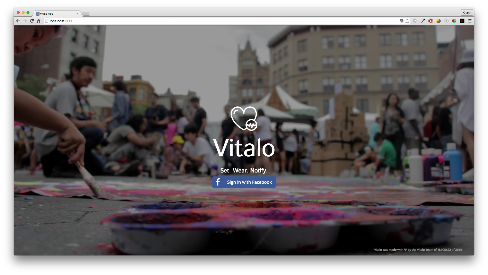
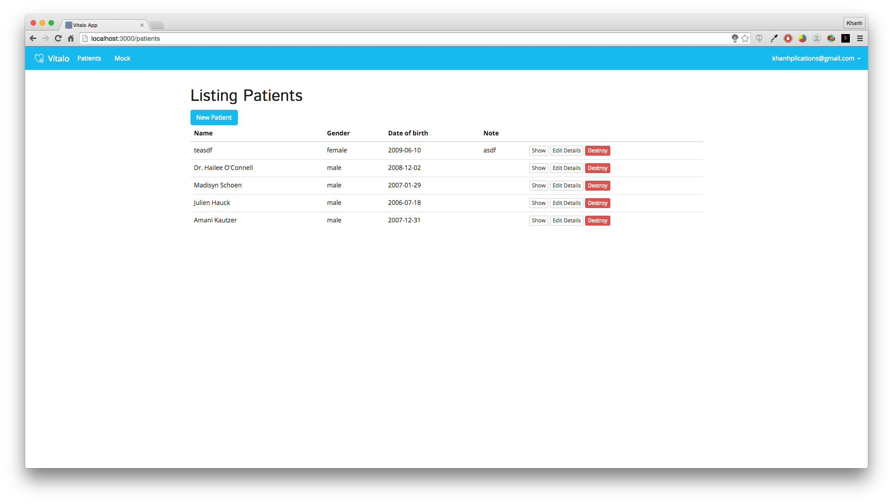
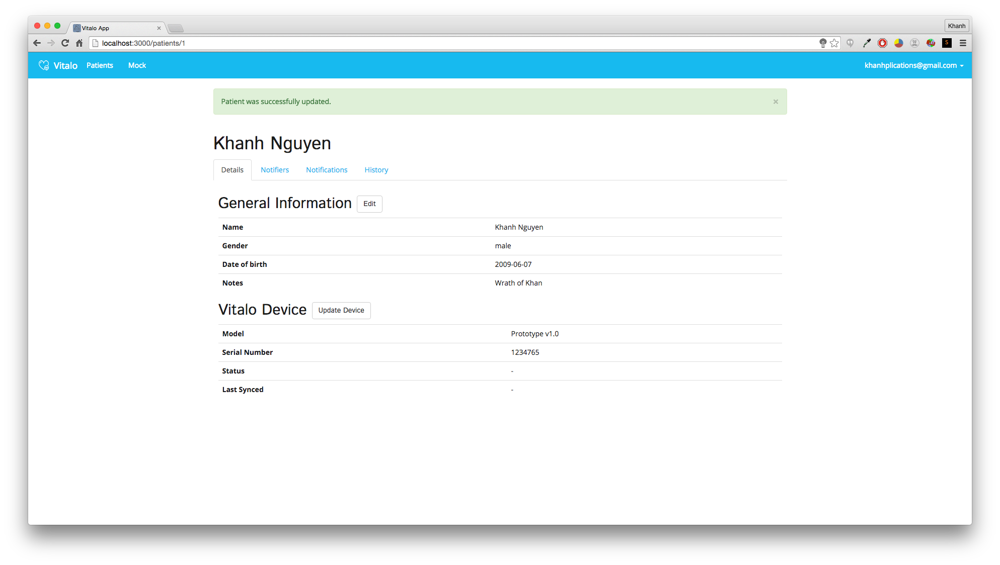
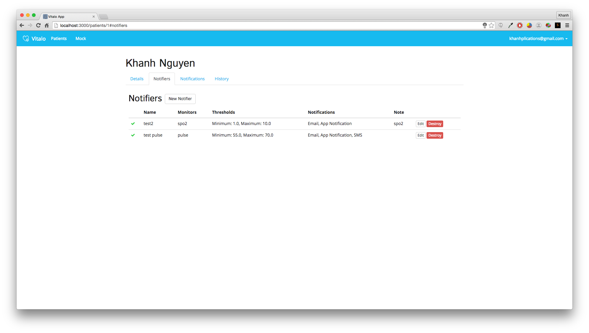
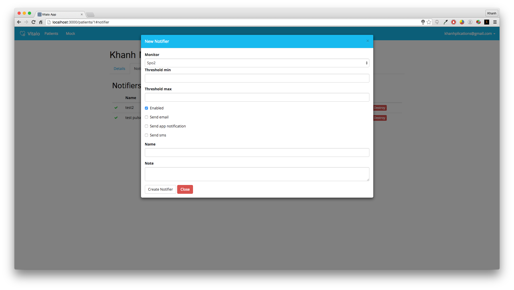
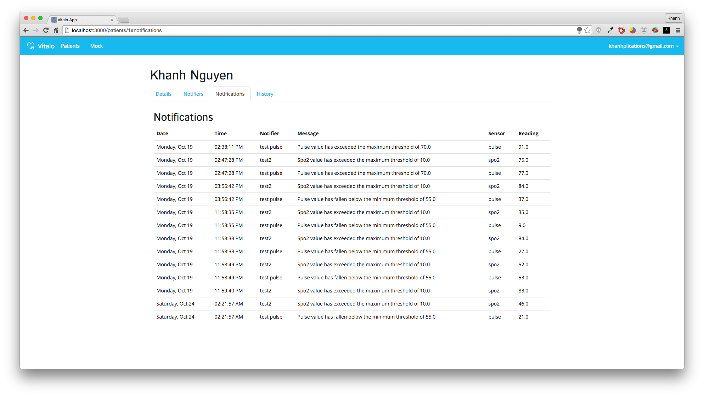
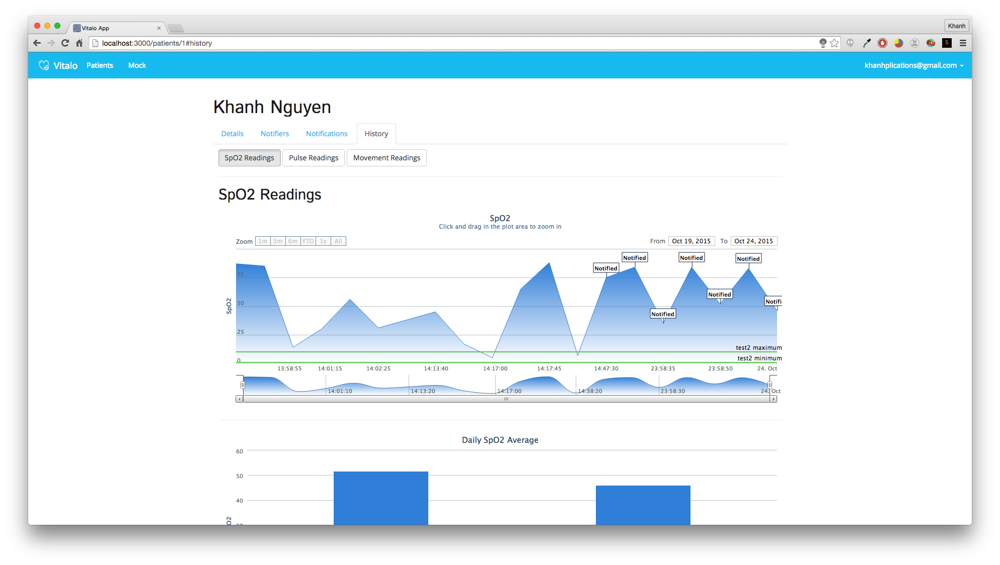

Vitalo (Manangement System)
================

- [Developer Setup](https://github.com/khanh2907/vitalo/wiki/Developer-Setup)

## Background
Vitalo is near real-time comfortable and convenient telemetry platform for kids with chronic illnesses and rare disorders. The objective of Vitalo is to create a robust, mobile, everyday-use medical monitoring device for children with severe chronic illnesses and rare disorders that is light-weight and unobtrusive, and provides accurate, real-time telemetry of pulse, oxygen saturation and symptomatic movement. A device whose data is accessible by parents, caregivers and physicians on existing mobile devices and desktop computers, unlike currently available devices, which have been designed for clinical applications and tend to be bulky, require direct visual monitoring and need to be returned to a clinician in order for meaningful data to be extracted and analyzed.

## Application
This is the source code for a Ruby on Rails application which is used to
manage and monitor Vitalo bands or sleeves. Caretakers can login with Facebook, create
patients, pair their devices and set notification triggers.

For research and hindsight analysis, the caretakers can also view the historical data of the readings of the their children/patients.

## Technologies
- Ruby 2.2.2
- Rails 4.2.0
- PostgreSQL 9.3
- Redis
- JavaScript and jquery
- Bootstrap 3

## Screenshots

Acknowledgements
-----------
This application was generated with the [rails_apps_composer](https://github.com/RailsApps/rails_apps_composer) gem
provided by the [RailsApps Project](http://railsapps.github.io/).
